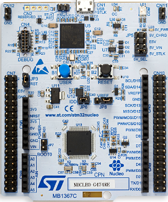

# 🚀 Git Tutorial  
### Learn Version Control with Git, VS Code & GitHub  

👨‍💻 
Trevor Douglas
SSE Lab Instructor

---
## Introduction

Introduce the students to some of the ARM architecture. Begin using the lab tools. The students will create a project and write an assembly program based on a simulated target.

### ARM Processor

- The Cortex-M3 processor is a high performance 32-bit processor designed for the microcontroller market. 
- Outstanding processing performance combined with fast interrupt handling
- Enhanced system debug with extensive breakpoint and trace capabilities.
- Efficient processor core, system and memories
- Ultra-low power consumption with integrated sleep mode and an optional deep sleep mode.

---
### Our Board - Nucleo-F103RB

<table>
  <tr>
    <td>
        <li>ARM 32 Bit Cortex-M3 Core</li>
        <li>Contoller - STM32F103RB</li>
        <li>72MHz Clock</li>
        <li>128kB Flash</li>
        <li>16kB SRAM</li>
        <li>Documentation available on the GitHub site</li>
    </td>
    <td> </td>
  </tr>
</table>
