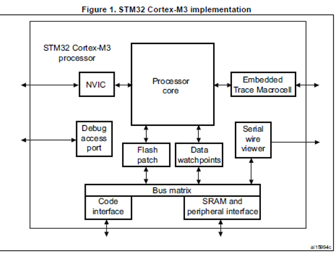
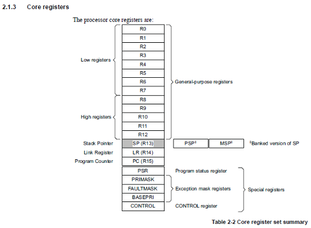
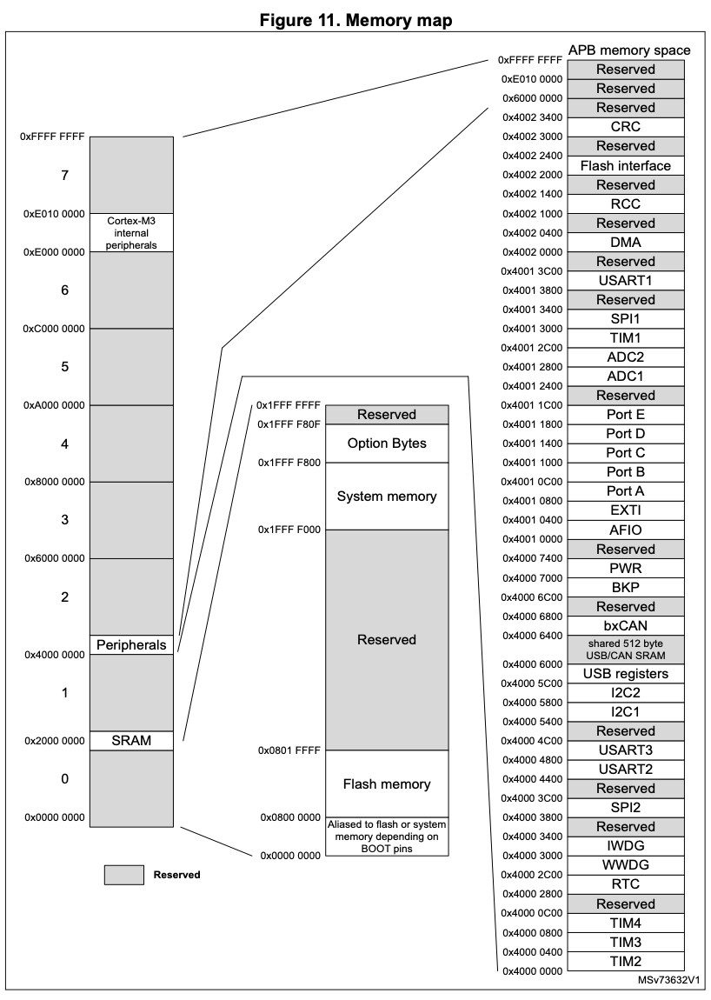
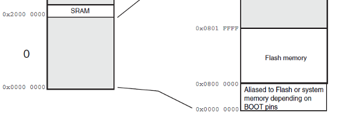

# 🚀 Introduction to ARM  

- Introduce the students to some of the ARM architecture. 
- Begin using the lab tools. 
- The students will create a project and write an assembly program based on a simulated target.
  
👨‍💻 
Trevor Douglas
SSE Lab Instructor

---
### ARM Processor

- The Cortex-M3 processor is a high performance 32-bit processor designed for the microcontroller market. 
- Outstanding processing performance combined with fast interrupt handling
- Enhanced system debug with extensive breakpoint and trace capabilities.
- Efficient processor core, system and memories
- Ultra-low power consumption with integrated sleep mode and an optional deep sleep mode.

---
### Our Board - Nucleo-F103RB

<table>
  <tr>
    <td>
        <li>ARM 32 Bit Cortex-M3 Core</li>
        <li>Contoller - STM32F103RB</li>
        <li>72MHz Clock</li>
        <li>128kB Flash</li>
        <li>16kB SRAM</li>
        <li>Documentation available on the GitHub site</li>
    </td>
    <td> </td>
  </tr>
</table>

---
### Block Diagram
<table>
  <tr>
    <td> </td>
  </tr>
</table>


---
### Registers
<table>
  <tr>
    <td> </td>
  </tr>
</table>

---
### Memory Map
<table>
  <tr>
    <td> </td>
  </tr>
</table>

---

### Flash Memory
<table>
  <tr>
    <td> </td>
  </tr>
</table>

<!--
Non-volatile vs Volatile memory.
-->

---
### Stack pointer

Our Board has its FLASH memory  at address 0x08000000.

The Stack Pointer (SP) is register R13.  The stack is a region of RAM that is used for storing various information.  You can think of it like those yellow sticky notes you used to save notes or phone numbers on. On reset, the processor loads the SP with the value from address 0x08000000.


### Program Counter

The Program Counter (PC) is register R15.  When you apply power to or reset your processor, it always reads  offset address 0x0x08000004 and puts the value it finds there into the PC.  This value MUST be a valid address pointing to the beginning of your code.

---
### Initial Code

```assembly

;ARM1.s Source code for my first program on the ARM Cortex M3
;Function Modify some registers so we can observe the results in the debugger

; Directives
	PRESERVE8
	THUMB
		
; Vector Table Mapped to Address 0 at Reset, Linker requires __Vectors to be exported
	AREA RESET, DATA, READONLY
	EXPORT 	__Vectors


__Vectors DCD 0x20002000 ; stack pointer value when stack is empty
	DCD Reset_Handler ; reset vector
	
	ALIGN

;My program, Linker requires Reset_Handler and it must be exported
	AREA MYCODE, CODE, READONLY
	ENTRY

	EXPORT Reset_Handler
		
		
Reset_Handler ;We only have one line of actual application code

	MOV R0, #0x76 ; Move the 8 bit Hex number 76

	ALIGN
		
	END
```

---

### Program counter

The Program Counter (PC) is register R15. It contains the current program address. Bit[0] is always 0 because instruction fetches must be halfword aligned. On reset, the processor loads the PC with the value of the reset vector, which is at address 0x08000004.

ARM processors use a pipeline (commonly 3 stages or more):

- Fetch instruction
- Decode instruction
- Execute instruction

While one instruction is executing, the next is already being fetched.

So when you read the PC:

You are seeing the address of an instruction already in the pipeline, not the one currently executing.

---