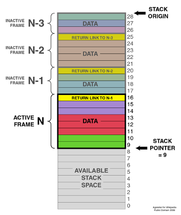

# 🚀 Lab 2 - Control Flow Statements  

The objective of this lab is to introduce the students to ARM assembly using control flow statements and instructions.
  
👨‍💻 
Trevor Douglas
SSE Lab Instructor

---
## Program Counter - R15

- The Program Counter is a register that contains the address of the current instruction.
- During normal logical flow the Program Counter increments according to the instructions implemented in order.
- After a branch or subroutine call the Program Counter will contain the “jumped to “ address.
- You are able to access this register from your code by using R15 or PC.


---
### The Stack

- Remember the stack pointer (R13) points to the top of stack.
- A typical stack is an area of computer memory with a fixed origin and a variable size. 
- A stack pointer, usually in the form of a hardware register, points to the most recently referenced location on the stack
- A stack is used to hold information as your program runs.  
 
 It is also used to:
 - Keep track of where you were during a branch or sub routine call.
 - Pass parameters to subroutines. 
 - Anything you would like saved.


---
### Push Operation
The two operations applicable to all stacks are:
- a push operation, in which a data item is placed at the location pointed to by the stack pointer, and the address in the stack pointer is adjusted by the size of the data item.  Push {R1},  or Push{R1,R2,R3}


#### Example
```assembly
    R0 = 0x11111111
    R1 = 0x22222222
    R2 = 0x33333333
    SP = 0x20001000   ; stack starts here (full descending stack)

    PUSH {R0, R1, R2} 
```


---
### Push Operation

#### Final Stack State
```assembly
    SP = 0x20000FF4

    Address         Value
    -------------------------
    0x20000FF4     0x33333333  (R2)
    0x20000FF8     0x22222222  (R1)
    0x20000FFC     0x11111111  (R0)
```
---
### Pull Operation

- a pop or pull operation: a data item at the current location pointed to by the stack pointer is removed, and the stack pointer is adjusted by the size of the data item. Pop {R1}, or Pop{R1,R2,R3}


```assembly
    POP {R0, R1, R2}

    R2 = 0x33333333
    R1 = 0x22222222
    R0 = 0x11111111


    SP = 0x20001000   ; stack back to the start
```

---

### Sample Stack
<table>
  <tr>
    <td> </td>
  </tr>
</table>

---
