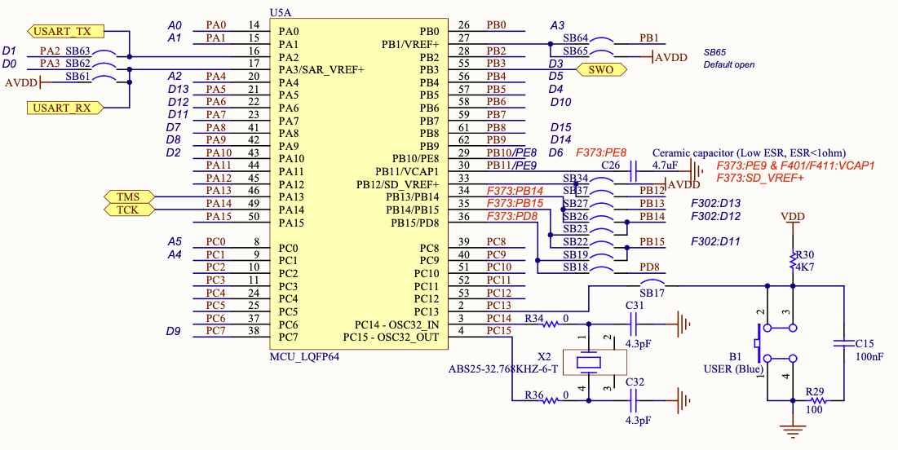

# 🚀 Lab 4 - STM32F103 I/O  

The objective of this lab is to introduce the students to general purpose I/O on the STM32F103RB microcontroller.  
  
👨‍💻 
Trevor Douglas
SSE Lab Instructor

---

## Background

General Purpose Input/Output (GPIO) refers to the use of logic level pins on the microcontroller device to connect to user input and output devices. It is often referred to as parallel I/O since multiple inputs or outputs appear in common registers inside the device. Reading a group of switches may be as simple as reading the value contained in one device register and driving outputs might be as simple as writing values to corresponding device registers.

Typically to control hardware peripherals you must write to registers that provide information on how that peripheral is to behave. 

---
## Background
*** Do not get these confused with registers from the ARM core!! ***

In order to write to these registers you must know the address(where they live in address space)and most importantly what bits to write to these registers. To know this you must **READ** the documentation of the registers so you know how they work.

---

<table>
  <tr>
    <td> </td>
  </tr>
</table>

Notice from the above schematic that the USER Blue Switch is located on PC 13.  Look at the circuit that is connected to this pin.  How will the current flow when the switch is pressed?  Take note of this pin.
