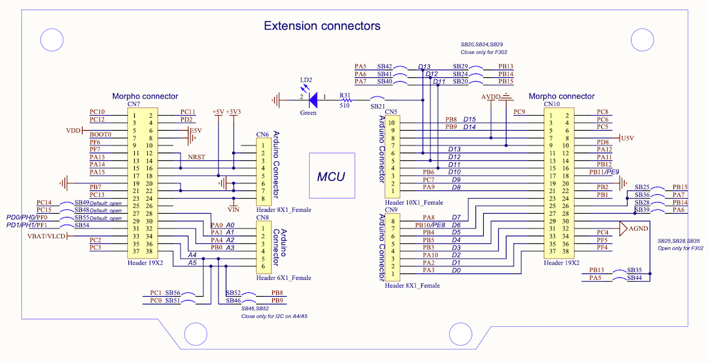
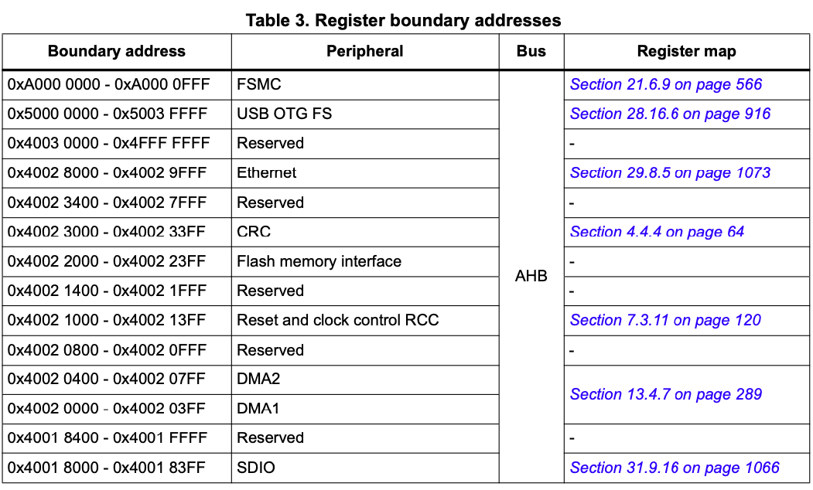
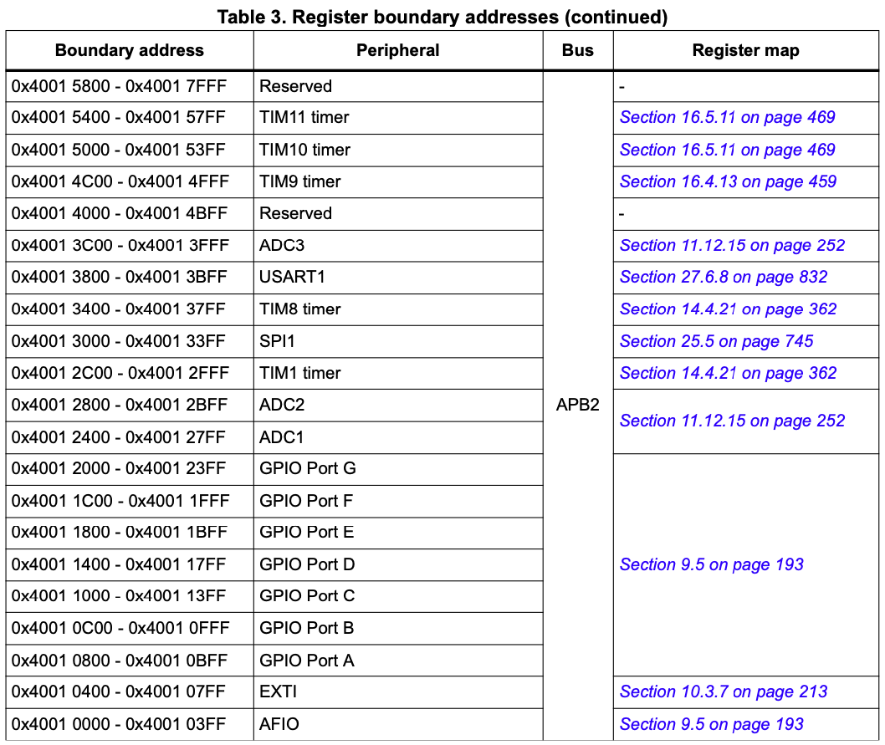
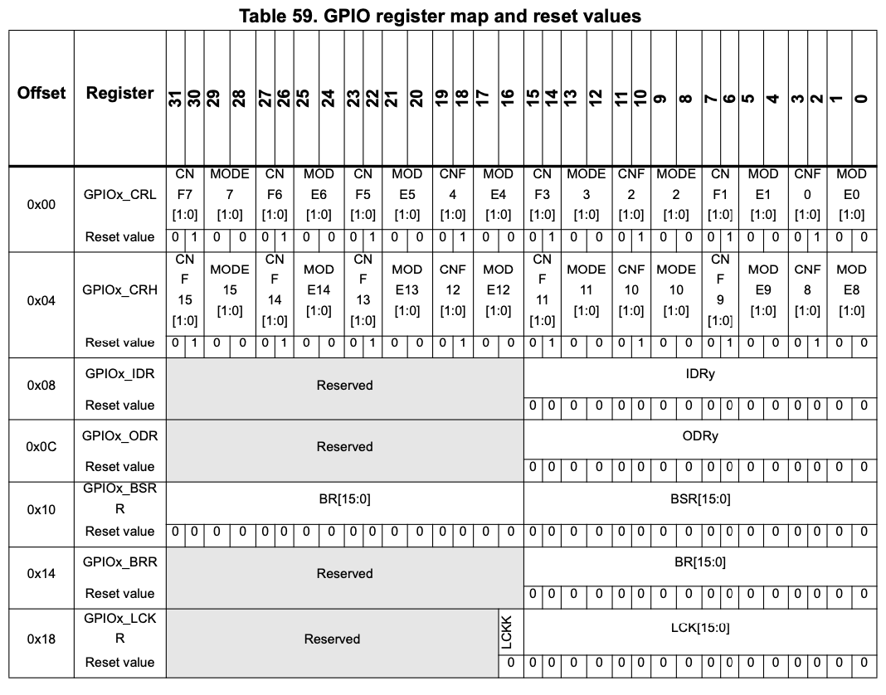
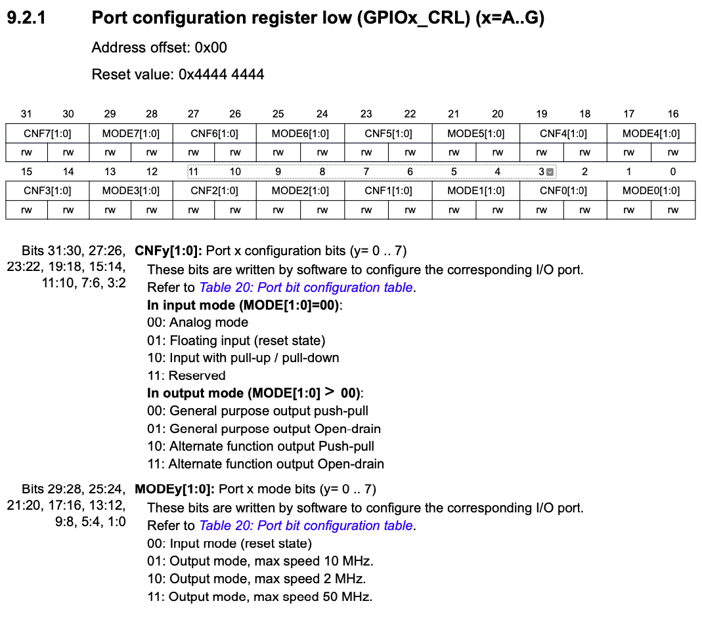

# 🚀 Lab 4 - STM32F103 I/O  

The objective of this lab is to introduce the students to general purpose I/O on the STM32F103RB microcontroller.  
  
👨‍💻 
Trevor Douglas
SSE Lab Instructor

---

## Background

General Purpose Input/Output (GPIO) refers to the use of logic level pins on the microcontroller device to connect to user input and output devices. It is often referred to as parallel I/O since multiple inputs or outputs appear in common registers inside the device. Reading a group of switches may be as simple as reading the value contained in one device register and driving outputs might be as simple as writing values to corresponding device registers.

Typically to control hardware peripherals you must write to registers that provide information on how that peripheral is to behave. 

---
## Background
*** Do not get these confused with registers from the ARM core!! ***

In order to write to these registers you must know the address(where they live in address space)and most importantly what bits to write to these registers. To know this you must **READ** the documentation of the registers so you know how they work.

---

<table>
  <tr>
    <td> </td>
  </tr>
</table>

Notice from the above schematic that the USER Blue Switch is located on PC 13.  Look at the circuit that is connected to this pin.  How will the current flow when the switch is pressed?  Take note of this pin.

---
<table>
  <tr>
    <td> </td>
  </tr>
</table>
Notice from the above schematic that the Green LED is located on PA 5.  Look at the circuit that is connected to this pin.  How will the current flow here? Take note of this pin.

---
### Discovering Peripheral Addresses

Peripheral Addresses are given a Boundary Address and an offset. This allows peripherals to be moved to different Boundary locations and their documentation and code templates do not have to change that often.

From our STM32F10xxRefMaual-2.pdf documentation:

---
<table>
  <tr>
    <td> </td>
  </tr>
</table>

---
<table>
  <tr>
    <td> </td>
  </tr>
</table>

---
<table>
  <tr>
    <td> </td>
  </tr>
</table>

---

### How to read and write to External Registers??

To Calculate the physical address you would add the boundary address + the offset.

Here is some sample code to read and write to external registers.

``` assembly

INITIAL_MSP	EQU	0x20001000	    ; Initial Main Stack Pointer Value
RCC_APB2ENR	EQU	0x40021018	    ; APB2 Peripheral Clock Enable Register
GPIOC_CRH	EQU	0x40011004    ;  Port Configuration Register for Px15 -> Px8


Ex : Writing to a register
LDR	R6, = RCC_APB2ENR	; R6 will contain the address of the register
MOV	R0, #0x001C	      ; Set these bits for whatever reason
STR	R0, [R6]

```

---

### Ex: Reading from a register and storing it  into an ARM register (R0)

``` assembly
LDR	R6, = GPIOC_CRH	    ; CRH determines gpio pins 8-15
LDR	R0,[R6]


Ex : Writing to a register without affecting bits I do not care about
LDR	R6, = RCC_APB2ENR	  ; R6 will contain the address of the register
LDR	R0,[R6]
ORR	R0, #0x001C	        ; Set these bits for whatever reason
STR	R0, [R6]

```

---

### What we know!  💡

So, now we have some information.  We know:
- Our LED is on PA 5.  That is Port A pin 5.
- Our blue button is on PC 13.  That is Port C pin 13.
- We know how to derive the addresses for the Ports we care about.
- From previous labs we know how to set and clear bits in registers.

<table>
  <tr>
    <td> </td>
    <td>In order to make the money we need to understand what registers to use and what bits we need to write to these registers.  Now we have to read the documentation!!!  However, since this is your first time doing this I will help you by indicating what external registers you should use.</td>
  </tr>
</table>

---

### Port pins - What do we need to do? 🧠
The following slides describe the steps you need to do to configure your I/O lines and how to change outputs and read inputs:

Earlier in the semester we discussed one of the benefits of the ARM architecture and the STM32F103B microcontroller is the ability to dynamically control power to the peripherals.  To use these I/O lines you will need to first turn on the clocks for PORT A and PORT C.  Investigate the  APB2 peripheral clock enable register (RCC__APB2ENR)  in the Reference Manual RM0008-rev21.pdf to do this. 

---

### Configuration
Now that you are providing a clocking source to your I/O lines you must configure the lines to support what is connected to them.  Look at GPIOx_CRL. (Notice GPIO_x_CRH also).

<table>
  <tr>
    <td> </td>
  </tr>
</table>

---
### More configuration!!
Notice that we need to configure Port A pin 5 as output, max speed 50MHz, general purpose output push-pull.  Notice that the CNF and MODE bits (4 bits in total) configure one I/O line.

PORT C pin 13 is connected to the blue button switch.  Look at  GPIOx_CRH and configure the MODE bits to input and the CNF bits to floating input. 

### Reading the state of switches and driving the LED's
Now that our port pins are configured, use GPIOx_ODR to change the state of our output I/O pins and use GPIOx_IDR to determine the state of our input I/O lines.

---
